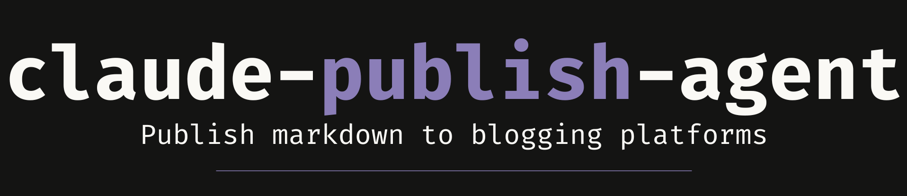

<p align="center">
  
</p>

# claude-publish-agent

> Publish markdown to blogging platforms without leaving Claude Code.

   

---

## The Problem

You wrote a great post. Now you need to publish it. Open Medium, paste the content, re-apply formatting that got lost, fix the code blocks, upload the header image, add tags, set the subtitle. Twenty minutes of friction for something you already wrote.

If you're publishing across projects, each with its own voice, color palette, and audience, the overhead multiplies. You end up with inconsistent branding, forgotten tags, and posts that sit in drafts because the publishing step is annoying enough to skip.

---

## Who This Is For

Developers who write in markdown and want to publish without the copy-paste-reformat dance. Especially useful if you maintain multiple projects with different brand voices and want each post to stay on-brand without thinking about it.

Works as both a **CLI tool** (install with pipx, use from your terminal) and a **Claude Code skill** (type `/publish` mid-session and Claude handles it).

---

## See the Difference

You just finished writing a blog post in your repo.

**Without the publish agent:**

> **You:** OK, post is done. Let me open Medium... copy the markdown... paste it... fix the code blocks that broke... re-add the header image... add tags... set the subtitle... publish.
>
> *(15 minutes of reformatting later)*

**With the publish agent:**

> **You:** /publish publish/posts/post-01-river.md
>
> **Claude:** Created gist. Import URL: `https://gist.github.com/...`. Open Medium → Your stories → Import a story → paste this URL. I've applied the style guide formatting and included your 5 recommended tags.

One command. Formatting handled. Tags included. Back to building.

---

## Install

### CLI (standalone)

```bash
pipx install claude-publish-agent
```

### Claude Code Skill

```bash
mkdir -p ~/.claude/skills/publish
curl -o ~/.claude/skills/publish/SKILL.md \
  https://raw.githubusercontent.com/code-katz/claude-publish-agent/main/SKILL.md
```

---

## Usage

### Publish to Medium (via GitHub Gist)

Medium's API is closed to new tokens. Instead, `claude-publish` creates a secret GitHub Gist and gives you a URL to paste into Medium's import tool.

```bash
# Create a gist and get the import URL
claude-publish gist post.md

# Then: Medium.com → Your stories → Import a story → paste URL
```

### Medium API (legacy token holders)

If you have a Medium integration token from before January 2025:

```bash
claude-publish setup medium
claude-publish medium post.md
claude-publish medium post.md --publish    # publish immediately
claude-publish medium post.md --tags "AI,Productivity"
```

### Check status

```bash
claude-publish status
```

---

## Content Kit

Each project can have a `publish/` directory with branding assets that the `/publish` skill uses to keep content on-brand:

```
publish/
├── style-guide.md          # Colors, typography, image style, voice/tone
├── images/
│   └── {project}-header.svg  # SVG banner for README and blog posts
├── posts/                  # Blog post files (post-{NN}-{slug}.md)
├── boilerplate.md          # (optional) Standard footer, CTAs
└── tags.json               # (optional) Default tags per platform
```

If the `/publish` skill detects a missing content kit, it walks you through creating one: just provide a project name, tagline, and accent color.

The skill also checks for linter configuration on first use. If no linter is configured for your project's stack, it flags it and recommends one before proceeding.

### Formatting conventions

The `/publish` skill enforces formatting rules when drafting, reviewing, or formatting content:

- **No emdashes.** The skill restructures sentences to use commas, colons, semicolons, parentheses, or separate sentences instead of emdashes. This keeps published content clean and consistent across posts.
- **Conversation dialogue as code.** In posts that show a conversation between the user and a Claude persona, all dialogue text renders as inline code (backticks) for a consistent terminal/chat visual.
- **Slash commands, CLI commands, and project names** render in code formatting throughout.

See this project's own [`publish/`](publish/) directory for an example.

---

## Supported Platforms

- **Medium** via GitHub Gist import or legacy API token
- **LinkedIn** (coming soon)

---

## Development

```bash
git clone https://github.com/code-katz/claude-publish-agent.git
cd claude-publish-agent
pipx install -e ".[dev]"
pytest tests/ -v
```

---

## Works Well With

| Project | What it does |
|---|---|
| [claude-team-cli](https://github.com/code-katz/claude-team-cli) | Eleven specialist personas for Claude Code; Toni helps with positioning, then you publish it |
| [claude-devlog-skill](https://github.com/code-katz/claude-devlog-skill) | Structured development changelog; write about the decisions you logged |
| [claude-roadmap-skill](https://github.com/code-katz/claude-roadmap-skill) | Living product roadmap with revision history; publish updates about what shipped and what's next |
| [claude-plans-skill](https://github.com/code-katz/claude-plans-skill) | Archives finalized implementation plans; turn completed plans into case studies |
| [claude-todo-skill](https://github.com/code-katz/claude-todo-skill) | Lightweight task scratchpad; track post ideas and publishing tasks |

---

## Repository Contents

| File | Purpose |
|---|---|
| `SKILL.md` | The skill source file (Claude's instructions for the `/publish` command) |
| `src/` | CLI source code (Python) |
| `tests/` | Test suite |
| `publish/` | This project's own content kit (style guide, header SVG, blog posts) |
| `DEVLOG.md` | Development log for this project |
| `README.md` | This file |

---

## License

See [LICENSE](LICENSE) for details.
